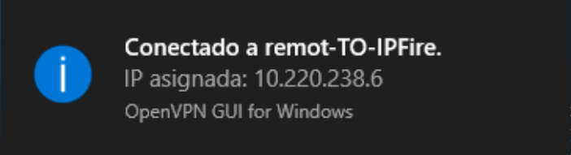

# AA4 NAT i VPN
## SMX 2A | Edu Gordo Cebrià

---

info

---

info

---

info

---

info

---

info

---

info

---

info

---

info

---

info

---

info

---

info

---

info

---

info

---

info

---

info

---

info

---

info

---

info

---

info

---

info

---

info

---

info

---

info

---

info

---

info

---

info

---

info

---

info

---

info

---

info

---
