# AA4 NAT i VPN
## SMX 2A | Edu Gordo Cebrià

---

info

---

info

---

info

---

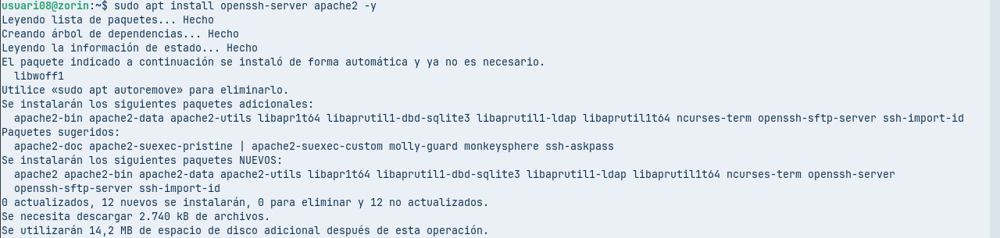

Executem la comanda per instal·lar els paquets **openssh-server** i **apache2** al sistema utilitzant `apt`.

---

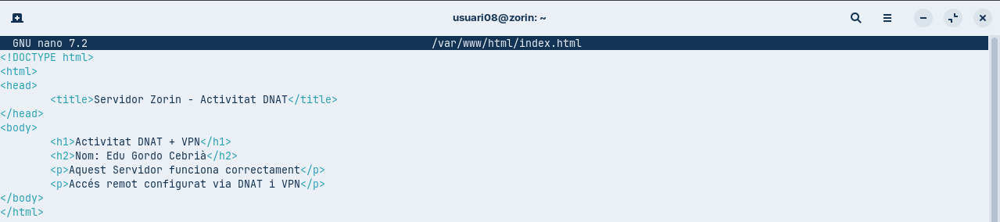

Editem el fitxer **index.html** amb nano per crear la pàgina web del servidor i afegim el contingut de l’activitat DNAT i VPN amb el títol, el nom i la descripció.

---

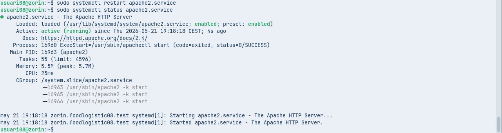

Reiniciem el servei **apache2** i comprovem el seu estat per verificar que s’està executant correctament.

---

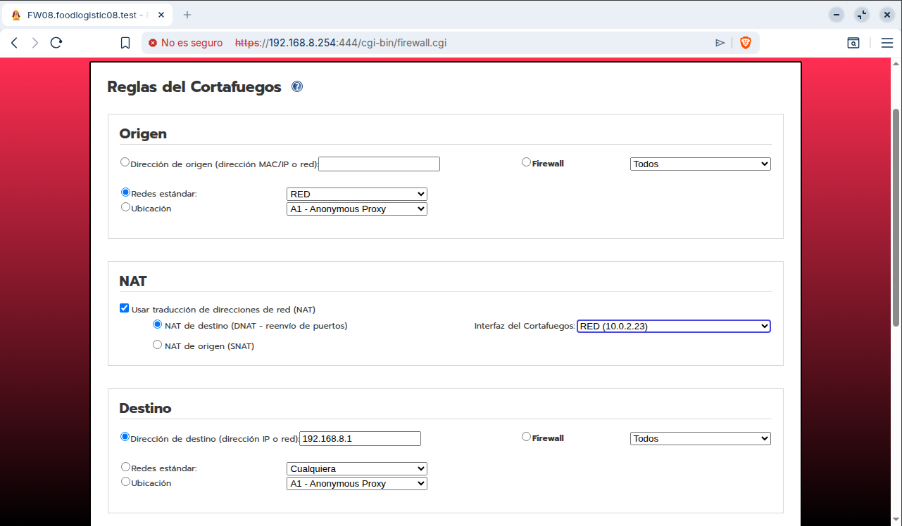

Configurem una regla de tallafocs aplicant **DNAT** per redirigir el trànsit cap a la IP interna **192.168.8.1** a través de la interfície especificada.

---

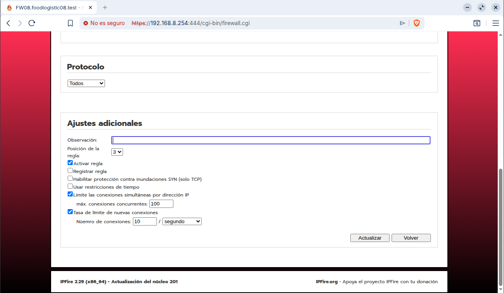

Configurem els ajustos addicionals de la regla activant-la i establint límits de connexions i taxa per controlar el trànsit.

---

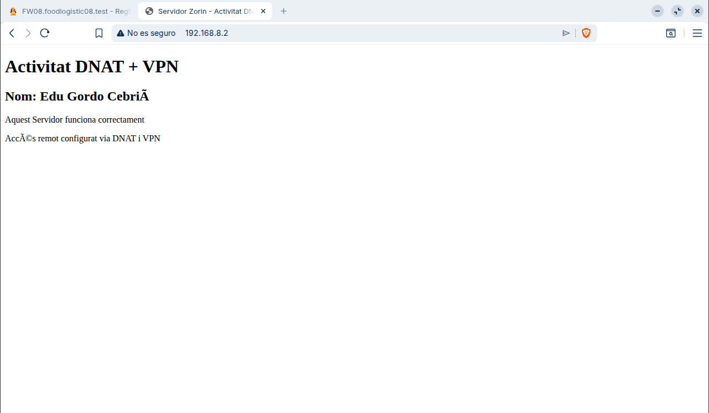

Accedim al servidor web des del navegador i comprovem que la pàgina es mostra correctament a través de la configuració DNAT.

---

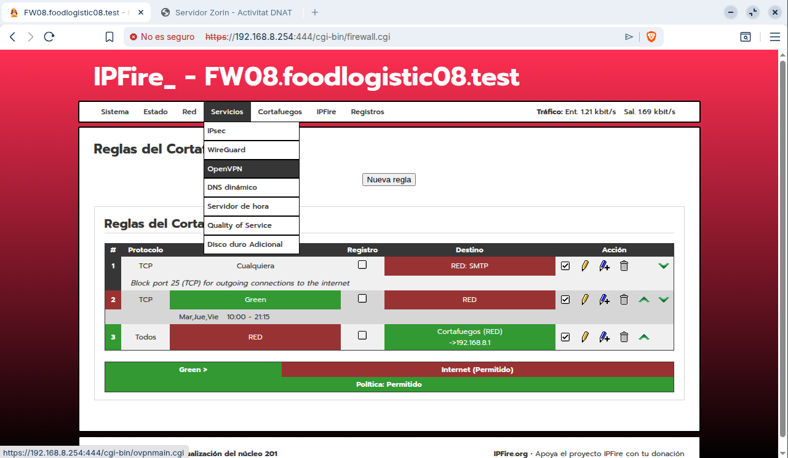

Accedim al panell d’IPFire i obrim el menú de serveis VPN per començar la configuració d’OpenVPN.

---

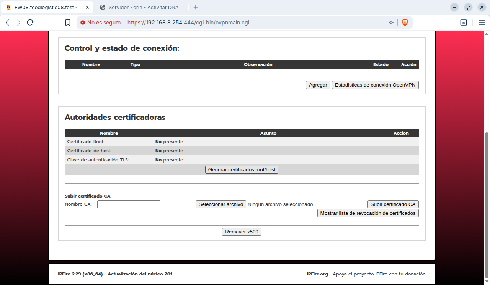

Accedim a la configuració d’OpenVPN i generem els certificats necessaris per establir la connexió segura.

---

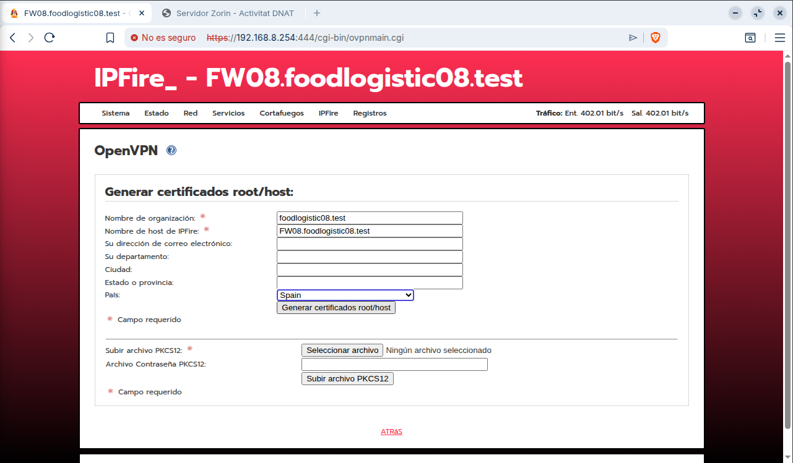

Omplim el formulari de generació de certificats d’OpenVPN amb les dades de l’organització i el servidor per crear les claus de seguretat.

---

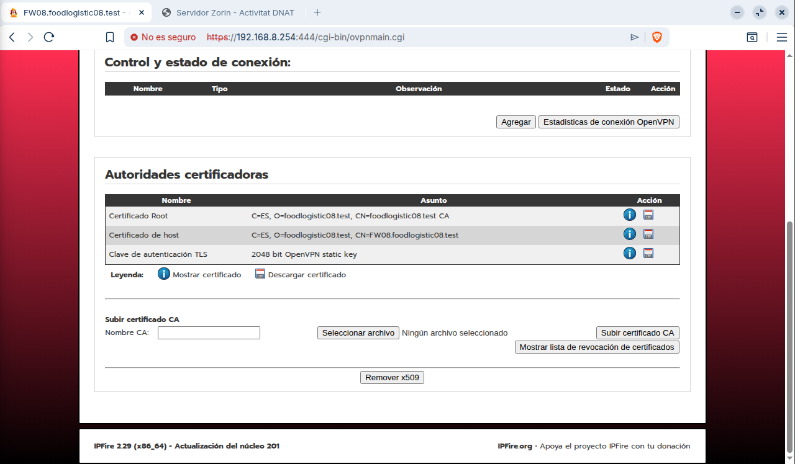

Comprovem que els certificats d’autoritat, host i la clau TLS s’han generat correctament per a la configuració d’OpenVPN.

---

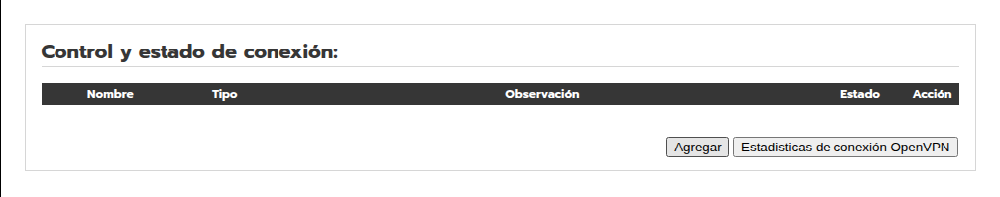

Premem el botó **“Agregar”** per afegir una nova configuració de connexió OpenVPN.

---

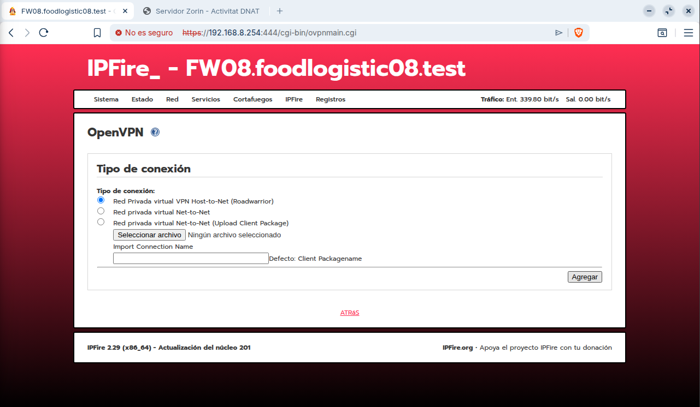

Seleccionem el tipus de connexió **Host-to-Net (Roadwarrior)** per configurar una VPN d’accés remot per als clients.

---

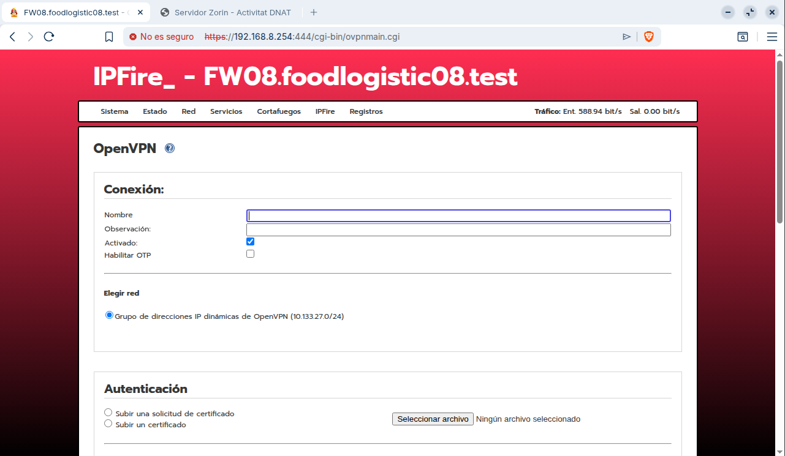

Omplim els camps de la connexió OpenVPN assignant un nom, activant-la i configurant el rang d’adreces IP dinàmiques per als clients.

---

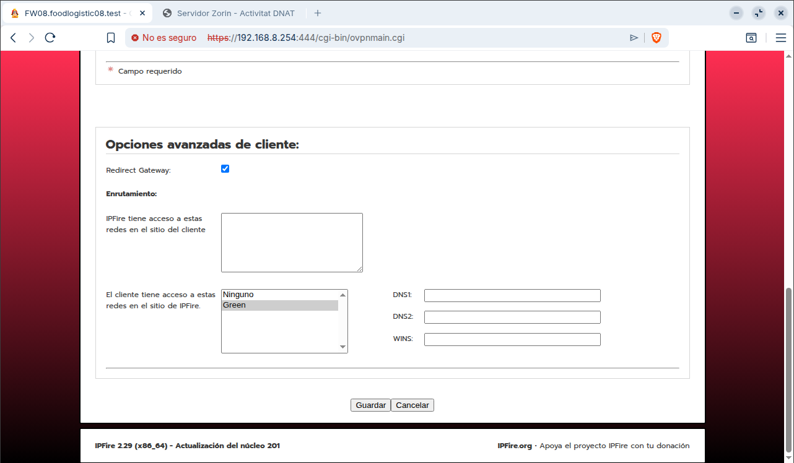

Configurem les opcions avançades del client activant el **redirect gateway** i definint les xarxes accessibles i els paràmetres de DNS.

---

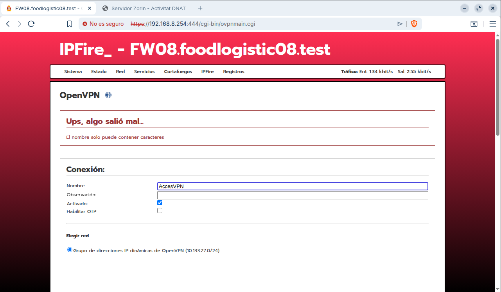

Ens surt un error en el nom de la connexió i cal corregir-lo perquè només accepta certs caràcters vàlids.

---

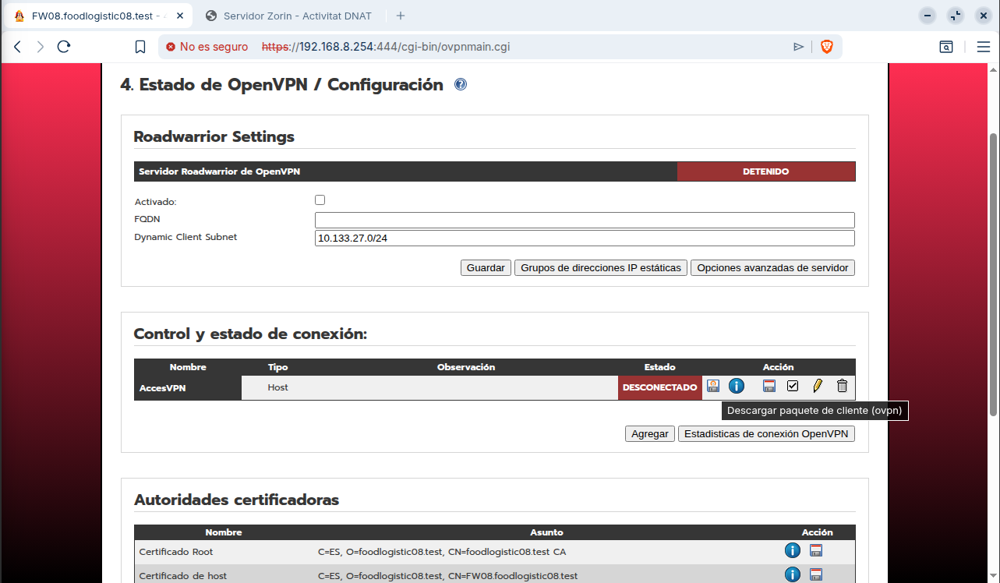

Activem i revisem la configuració del servidor **OpenVPN Roadwarrior**, comprovant que la connexió creada apareix.

---

Desem el fitxer de configuració del client OpenVPN amb extensió **.ovpn** a l’equip local.

---

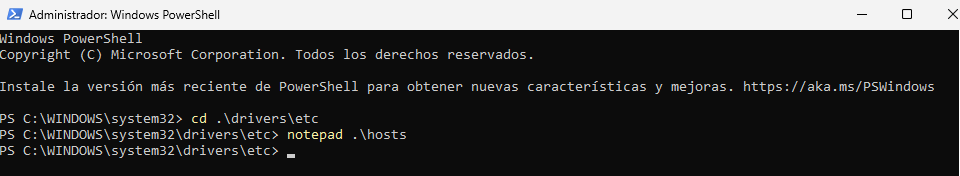

Accedim al directori **drivers\etc** des de PowerShell i obrim el fitxer **hosts** amb el bloc de notes per editar-lo.

---

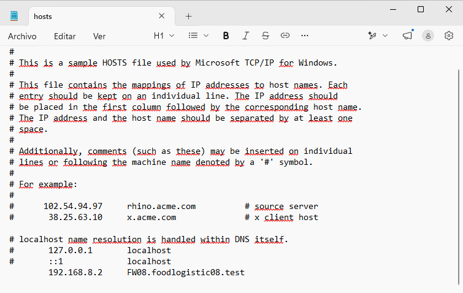

Editem el fitxer **hosts** afegint la correspondència entre la IP **192.168.8.2** i el nom de domini **FW08.foodlogistic08.test** per resoldre’l localment.

---

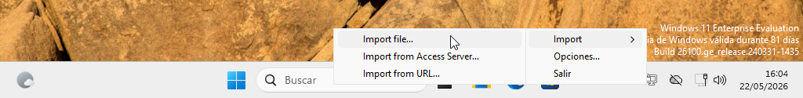

Seleccionem l’opció **“Import from file…”** per carregar el fitxer de configuració del client OpenVPN.

---

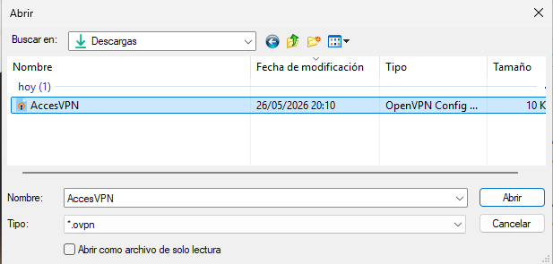

Seleccionem el fitxer **AccesVPN.ovpn** des de la carpeta de descàrregues per importar la configuració del client OpenVPN.

---

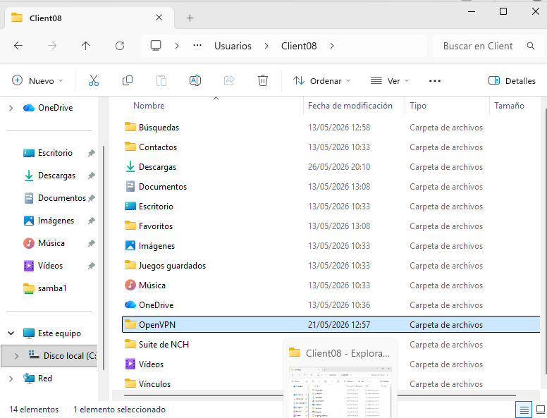

Accedim a la carpeta de l’usuari i localitzem el directori **OpenVPN** on gestionarem els fitxers de configuració del client.

---

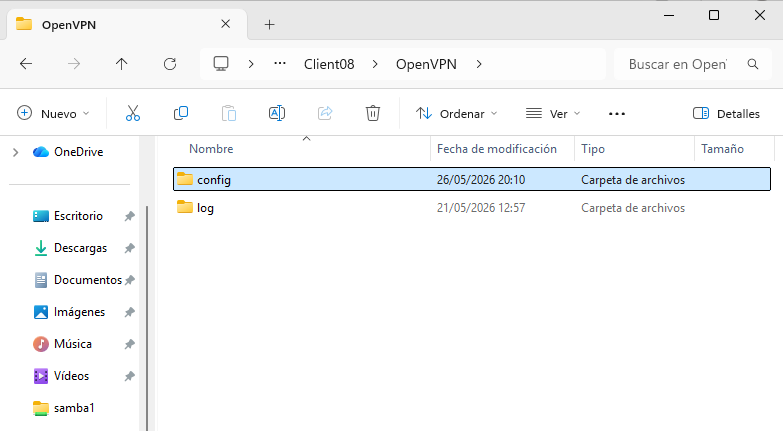

Entrem dins la carpeta **config** del directori d’OpenVPN per col·locar-hi els fitxers de configuració del client.

---

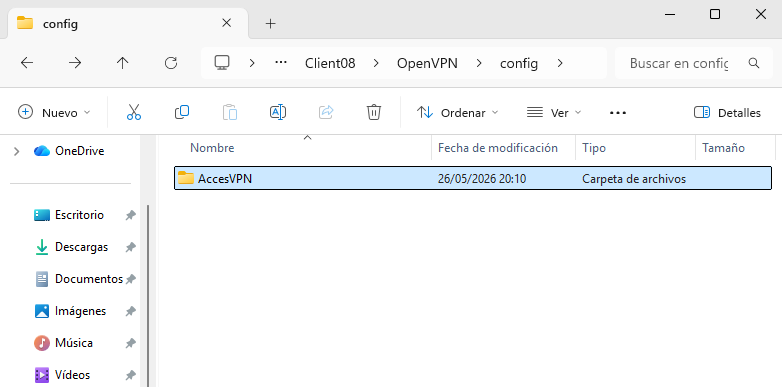

Accedim a la carpeta **config** i verifiquem que hi ha el directori **AccesVPN** amb els fitxers de configuració preparats per al client OpenVPN.

---

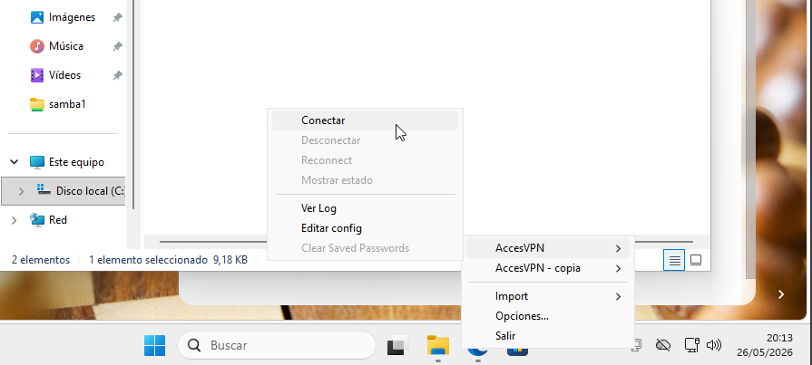

Obrim el menú del client OpenVPN i seleccionem l’opció **Connectar** per iniciar la connexió VPN.

---

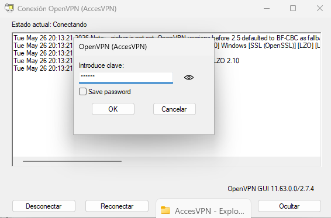

Introduïm la contrasenya del client OpenVPN i completam la connexió, confirmant que l’accés VPN s’estableix correctament i permet la comunicació segura amb la xarxa interna.

---

