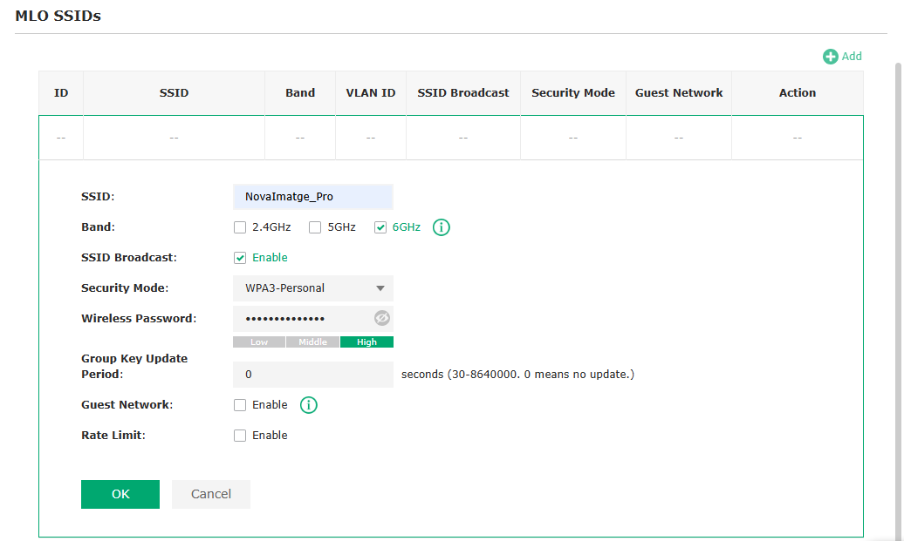
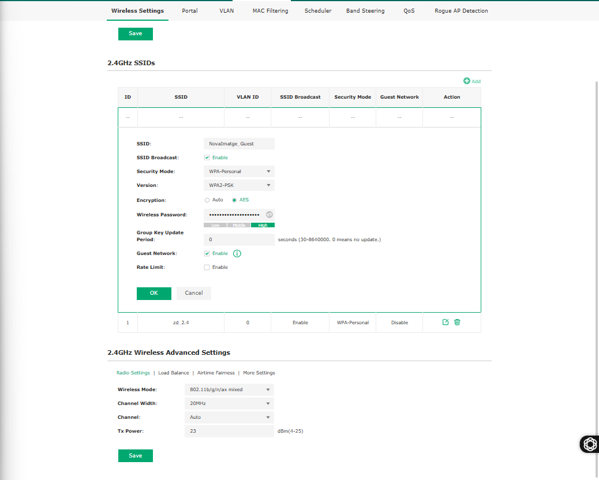

| FULL DE PRESENTACIÓ D’ACTIVITAT  | IMO30FP06 REV 00 11/15 |
| :---- | :---- |

| Curs:  | CFGM SMX 2A |  
| :---- | :---- |
| Matèria:  | 0227 Serveis de Xarxa |  
| Tema  | RA7. Desplegament de xarxes sense fils |  
| Professor/s:  | C. Alonso, B. Redondo |  
| Alumne: | Edu Gordo Cebrià |  

## Desplegament de Xarxa Wi-Fi 7 per a "Nova Imatge" Introducció

L'empresa de disseny gràfic i edició de vídeo "Nova Imatge" s'ha traslladat a una oficina de 120 m². Treballen amb fitxers de vídeo en 8K molt pesants i necessiten la màxima velocitat sense fils possible per als seus portàtils d'última generació. A més, reben clients sovint i volen oferir-los connexió a Internet sense que aquests puguin accedir a la xarxa interna de l'empresa.

Com a tècnic que hi dones suport a l’empresa, has fet una selecció prèvia de diferents opcions de mercat i has decidit triar una solució professional basada en adquirir un punt d’accés **TP-Link Omada EAP772**, per tal d’aprofitar la xarxa 10GB Ethernet de la que disposa el client.

## Tasques a realitzar

### 1. Pressupost de la posada en marxa

En primer lloc, cal que cerqueu per Internet a un distribuïdor nacional o local el cost de compra de dos punts d’accés del requerits. És important que cerqueu el preu

| DISTRIBUÏDOR | PREU UNITARI | PREU TOTAL |
| :---- | :---- | :---- |
| MediaMarkt | 236,29 € | 472,58 € |
| PcComponentes | 182,54 € | 365,08 € |
| Amazon.es | 192,49 € | 384,98 € |

L’opció més adequada des del punt de vista pressupostari és adquirir els punts d’accés a través de PcComponentes, ja que ofereix el preu més assequible del mercat en el moment de la consulta. Tot i això, alternatives com MediaMarkt o Amazon també es poden considerar en cas que no fos possible disposar del producte mitjançant la primera opció, garantint així la disponibilitat del material.

### 2. Simulació de la configuració

Per realitzar la tasca de configuració, usarem el simulador disponible a https://www.tp-link.com/es/support/emulator/ cerqueu la versió més moderna de firmware per l’equip indicat.

Heu d’accedir al simulador d’interfície web i documentar les següents configuracions:

### Configuració de Xarxa Corporativa. Opció 1: WiFi 7 a 6 GHz

- Nom de la xarxa (SSID): NovaImatge_Pro  
- Mode funcionament: 6 GHZ. Configura els canals per poder operar a la UE  
- Seguretat: WPA3  

Amb la configuració del canal en mode automàtic i l’amplada de canal permet que el punt d’accés seleccioni únicament canals autoritzats per la UE, garantint el compliment de la normativa Europea

### Configuració de Xarxa Corporativa. Opció 2: WiFi 7 a 5 GHz

- Nom de la xarxa (SSID): NovaImatge_Pro  
- Mode funcionament: 5 GHZ. Configura els canals per poder operar a la UE  
- Seguretat: WPA3  

### Configuració de Xarxa Corporativa. Opció 3: MLO

- Nom de la xarxa (SSID): NovaImatge_Pro  
- Mode funcionament: MLO amb 5 i 6 GHZ  
- Seguretat: WPA3  

Què caldria habilitar per poder operar amb les tres bandes?

Per poder operar amb les tres bandes, cal habilitar l’opció de **Multi‑Link Operation (MLO)** a totes les bandes disponibles del punt d’accés i disposar de dispositius clients compatibles amb **WiFi 7 (802.11be)**, mantenint la seguretat **WPA3** activada.

### Configuració de Xarxa de Convidats

- Nom de la xarxa (SSID): NovaImatge_Guest  
- Banda activa: Només 2.4 GHz per assegurar compatibilitat amb dispositius antics  
- Seguretat: WPA2-PSK  
- Habilitar l'aïllament de clients (Guest Network)  

Aquesta configuració permet l’aïllament de clients en la xarxa de convidats, impedeix la comunicació entre els dispositius connectats i evita l’accés a la xarxa corporativa interna, millorant la seguretat, la privadesa i el control de la infraestructura de la xarxa.

El simulador no permet emmagatzemar les configuracions, per això és important que feu la captura de pantalla abans de donar a **Save**.

El simulador no permet emmagatzemar les configuracions, per això és important que feu la captura de  pantalla abans de donar a **Save**.

---
