# Afegir Linux a Active Directory  
## [Eduard Gordo Cebria](mailto:eduard.gordo@mataro.epiaedu.cat)

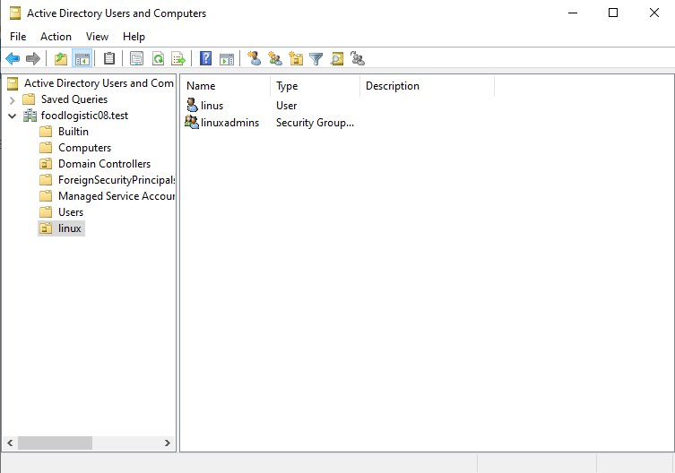

Creem els usuaris de linux per la nostra màquina Zorin OS i afegim un grup de seguretat, on haurem de posar els usuaris que vulguem que estiguin dintre per aplicar permisos i treurels a tots els usuaris que és trobin dons del grup de seguretat

---

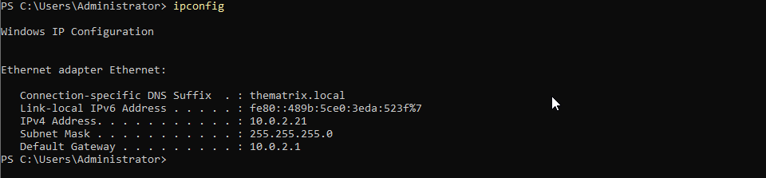

Comprovem la IP de l’adaptador 0 del servidor

---

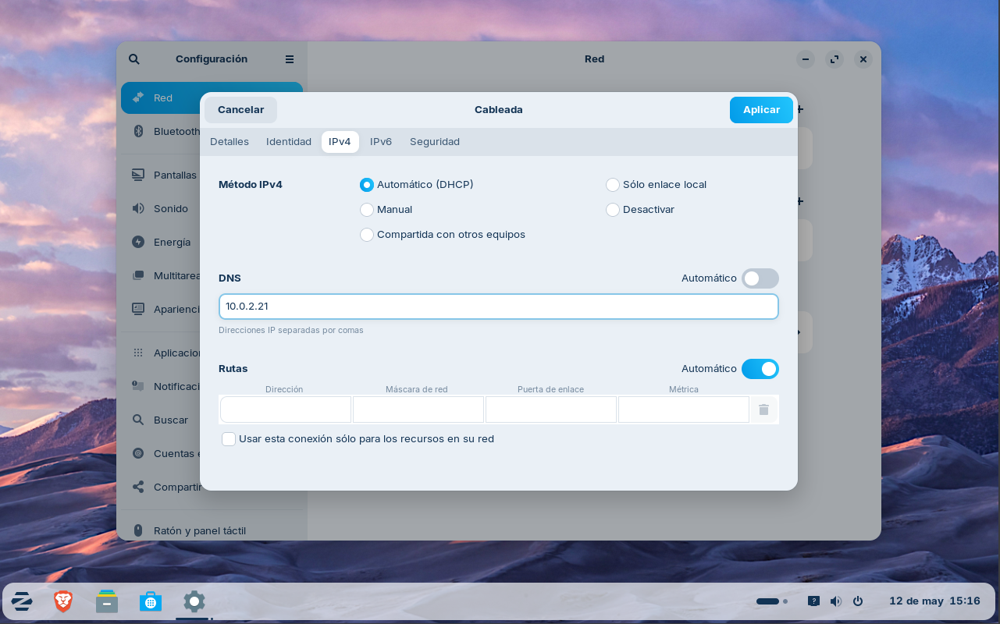

Assignem en IPv4 de la màquina Zorin el DNS del servidor, apliquem els canvis i continuem

---

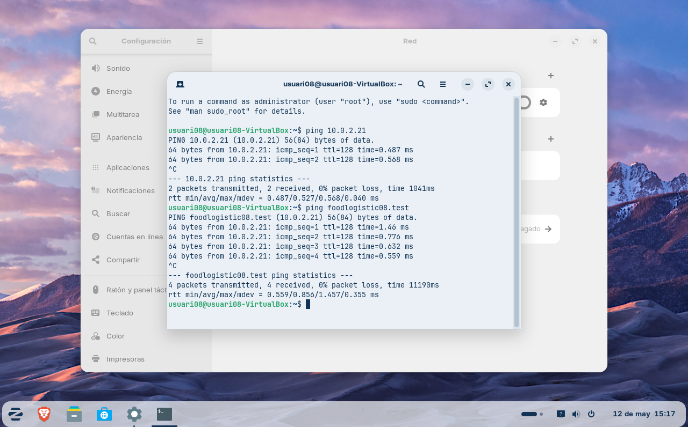

Comprovem fent ping tant al servidor com al domini que funciona correctament la conexió  

---

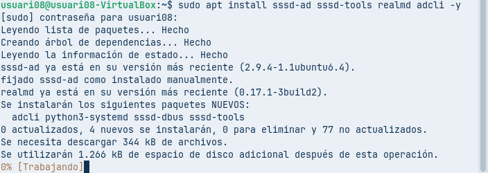

Instal·lem els paquets de active directory per a zorin

---

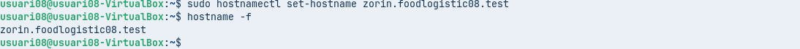

Canviem el nom del Hostname en la màquina i li posem el domini del servidor

---

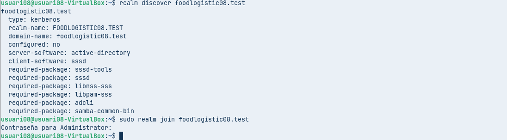

Amb la comanda “realm discover” comprovem que la màquina troba correctament el domini i fa la connexió amb el servidor. Seguidament, amb la comanda “join”, unirem el dospositiu al domini, i si ens deixa continuar sense problemes vol dir que ens hem unit al domini correctament   

---

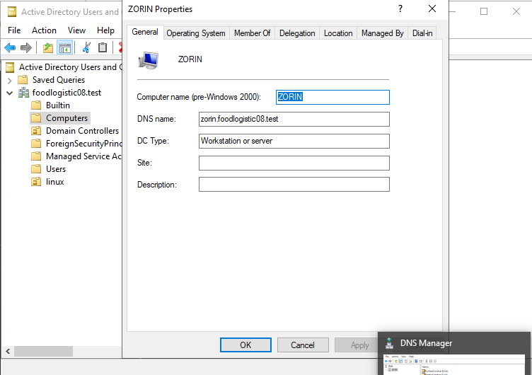 

Com podem veure, només completar aquests passos, en la carpeta de AD “Computers” ja ens apareix el nou dispositiu

---

  

Afegim la configuració perque quan un usuari del Active Directory es connecti al client Zorin per primer cop es definiexi a la carpeta personal  

---

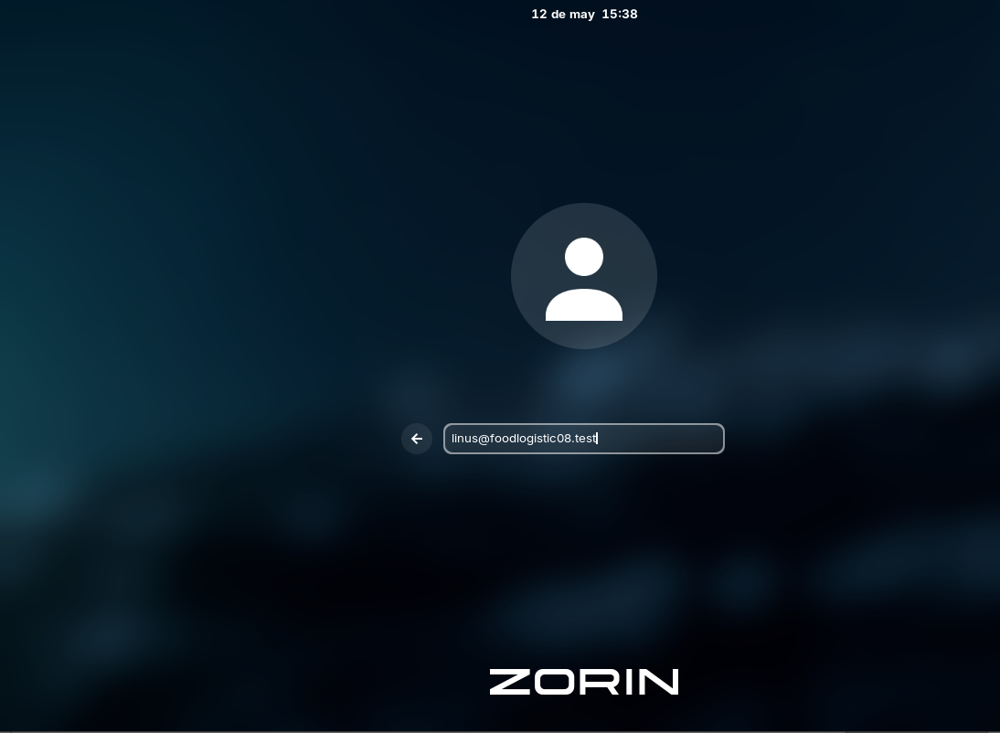

Seguidament iniciem sessió amb l’usuari que hem creat dins de la carpeta de linux

---

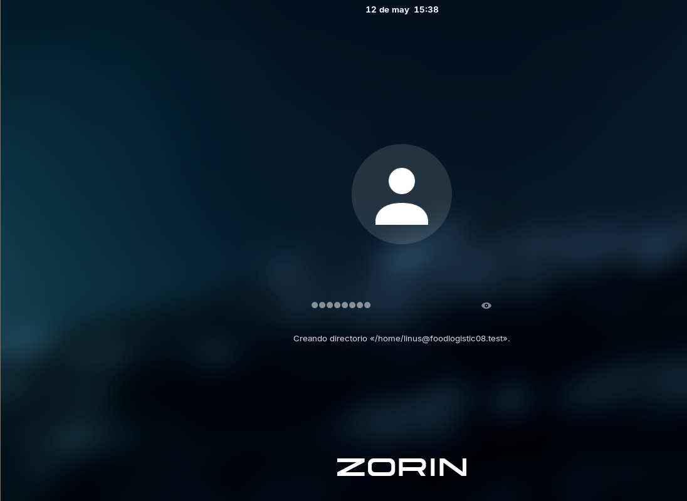

En posar la contrasenya de l’usuari ja ens sortirà el missatge de “creando directorio /home/…” I es crearà la carpeta personal de l’usuari directament gràcies a la configuració previa que li hem assignat

---

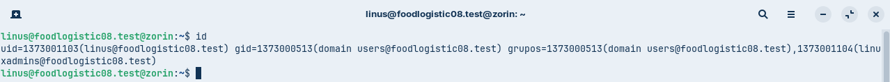

Si posem “id” podrem veure que l’usuari pertany al domini  

---

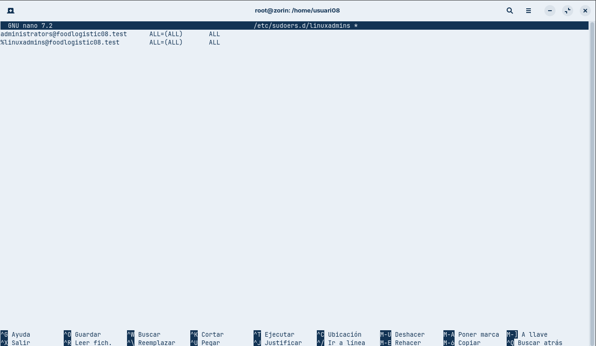

Tornem a iniicar sessió amb l’usuari administrador de la màquina i creem el fitxer del sudoers. Afegim en aquest fitxer el grup dels usuaris que estiguin dins del grup de linux en el domini

---

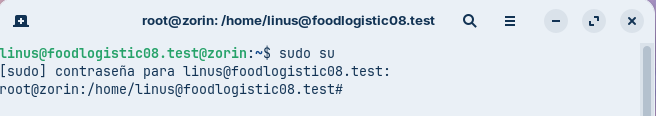

Ara, en tornar a iniciar sessió, podrem comprovar que l’usuari es converteix en administrador i podem executar amb exit la comanda “sudo su”

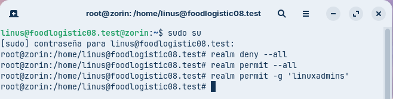

Podem treure i posar permisis a qualsevol grup oa  tothom directament amb l’usuari  

---

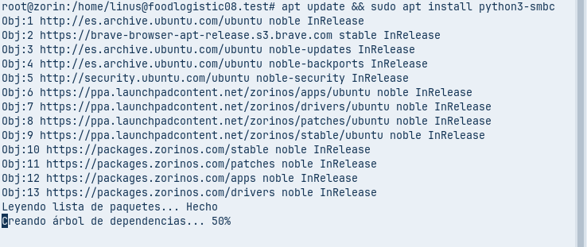

Instal·lem el paquet de “smb”

---

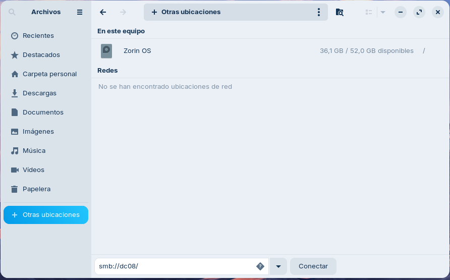

Anem al explorador d’arxius i busquem el directori del servidor en la pestanya de “Otras Ubicaciones”  

---

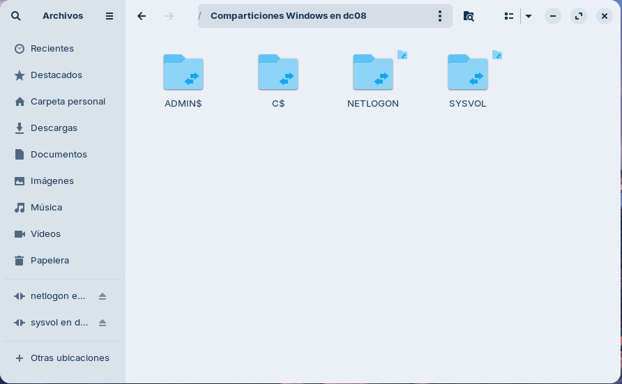

Si hem fet la configuració i la instal·lació bé ens hauria de srtir correctament el directori del servidor, pero com que no tenim permisos d’administrador dels servidor no podrem entrar en totes les carpetes, pero si que podrem accedir a algunes d’elles

I amb aixo Finalitza la pràctica
