# Tallafocs: UFW
SMX 2A | Edu Gordo

Preparació inicial  
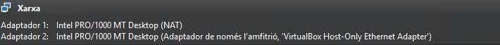

Configurem la màquina virtual amb dos adaptadors de xarxa: un en mode **NAT** per disposar de sortida a Internet i poder provar les regles de trànsit de sortida, i un **Host-Only** per permetre la comunicació amb l’amfitrió i comprovar les regles d’accés al servidor nginx de manera controlada.

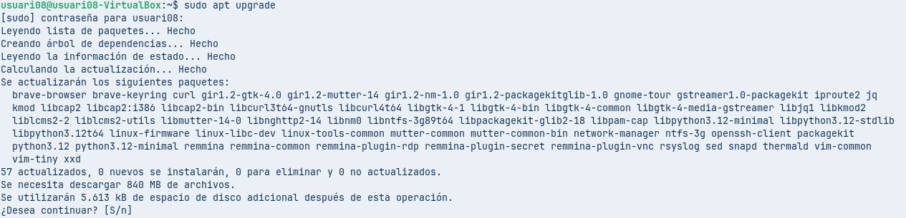

Actualitzem el sistema executant `sudo apt upgrade` per instal·lar totes les actualitzacions disponibles dels paquets, assegurant que el sistema estigui al dia abans de continuar amb la configuració i comprovació de les regles.

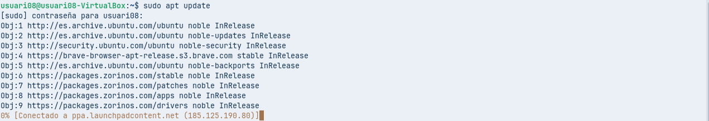

Actualitzem la informació dels repositoris executant `sudo apt update` per obtenir la llista més recent de paquets disponibles i assegurar que el sistema disposa de dades actualitzades abans d’aplicar canvis o configurar les regles de seguretat.

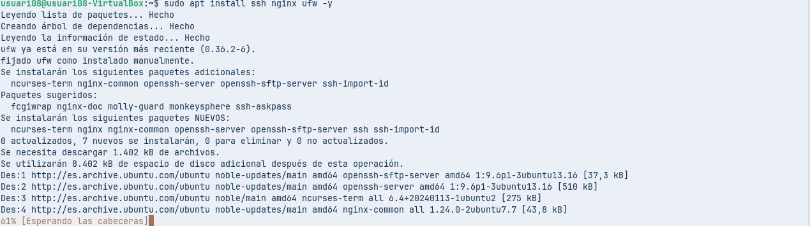

Instal·lem els paquets **SSH**, **nginx** i **ufw** amb `sudo apt install ssh nginx ufw -y` per disposar del servidor web, l’accés remot i el tallafoc necessaris per aplicar i comprovar les regles de seguretat del sistema.

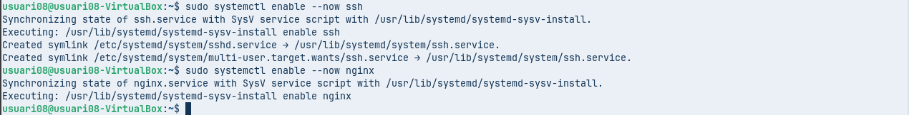

Habilitem i iniciem els serveis **SSH** i **nginx** amb `systemctl enable --now` perquè arrenquin automàticament amb el sistema i quedin actius per poder aplicar i comprovar les regles del tallafoc sobre aquests serveis.

1. Comprova l’estat del firewall i si cal habilita’l  
   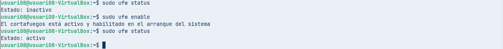
   Comprovem l’estat del tallafoc amb `ufw status`, observem que està inactiu i tot seguit l’habilitem amb `ufw enable` per activar-lo i garantir que les regles de seguretat s’apliquin automàticament a l’arrencada del sistema.  
2. Mostra de les regles que té definides. Quines són les regles per defecte?  
   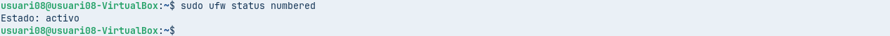
   Mostrem les regles del tallafoc amb `ufw status numbered` per comprovar que l’UFW està actiu i verificar quines regles hi ha definides actualment, encara que en aquest punt no n’hi hagi cap creada.  
     
3. Comprova la regla per sefecte de deny pel trànsit d’entrada. Connectat des l’amfitrió a aquest equip cia SSH i observa que no et pots connectar  
   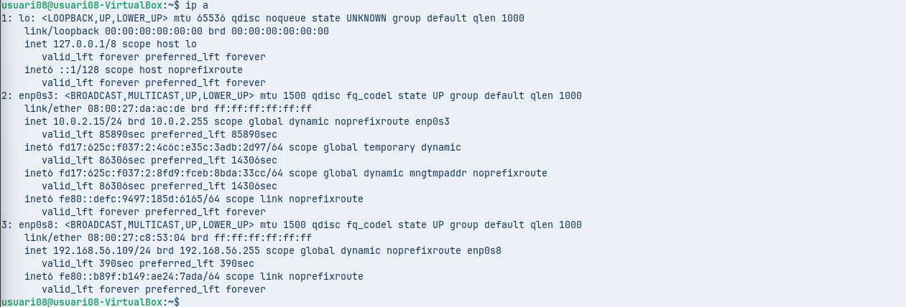
   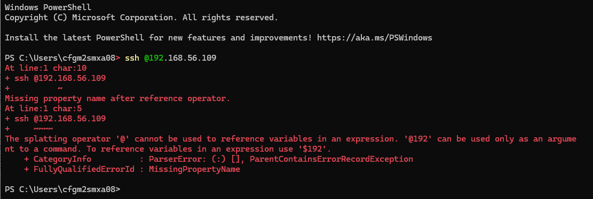  
   Consultem les adreces IP de la màquina virtual amb `ip a` per identificar les interfícies NAT i Host-Only i provem la connexió SSH des de l’amfitrió, comprovant així l’accés al servei i detectant errors de connexió des de Windows.  
     
4. Aplica regla per defecte deny al trànsot de sortida. Prova ara a fer el “ping” a Google  
   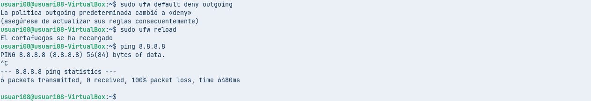  
   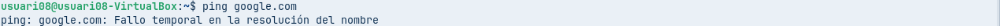
   Configurem l’UFW perquè **denegui per defecte el trànsit de sortida** amb `ufw default deny outgoing`, recarreguem les regles i **comprovem que la política funciona correctament** verificant que no hi ha connectivitat a Internet mitjançant `ping` tant a una IP externa com a un nom de domini.  
5. Aplica regla per defecte allow al trànsot de sortida. Comprova que ara sí que pots fer “ping” a Google

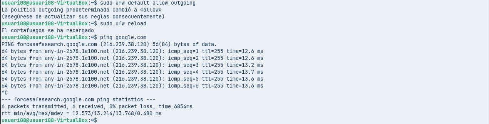

Canviem la política per defecte del trànsit de sortida a **allow** amb `ufw default allow outgoing`, recarreguem el tallafoc i **comprovem que la connexió a Internet torna a funcionar correctament** fent un `ping` a un domini extern.

6. Crear una regla per prohibir el trànsit cap\`l’adreça del [capgros.elnacional.cat](http://capgros.elnacional.cat). Comprova’l fent un “ping”  
   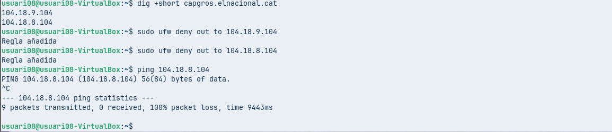  
   Resolem l’adreça IP del domini amb `dig` i apliquem regles **deny de trànsit de sortida** amb UFW cap a aquestes IPs per **prohibir l’accés a un lloc web concret d’Internet**.  
     
7. Habilita el trànsit d’entrada pel servei nginx per la IP de l’amfitrió (192.168.56.1) comprova que connecta  
   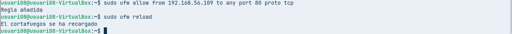  
   Creem una regla amb UFW que **permet l’accés al servidor nginx pel port 80 només des de l’amfitrió amb la IP 192.168.56.109**, i recarreguem el tallafoc per aplicar el canvi i poder comprovar el funcionament del servei web.  
     
8. Mostra el conjunt de regles definides

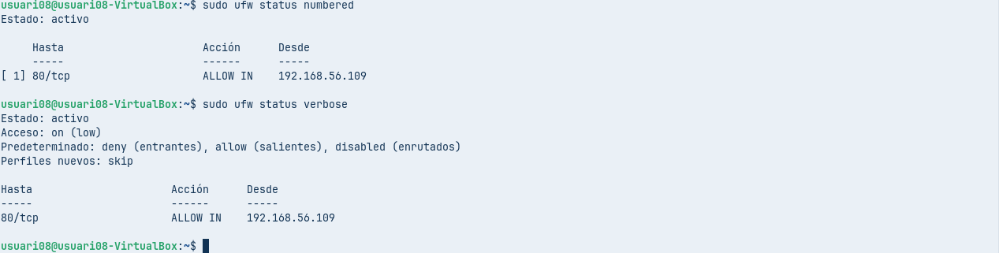

Mostrem totes les regles creades amb `ufw status numbered` i `ufw status verbose` per **verificar i documentar correctament** les regles actives, les polítiques per defecte i confirmar que el servidor nginx només és accessible des de la IP autoritzada.
